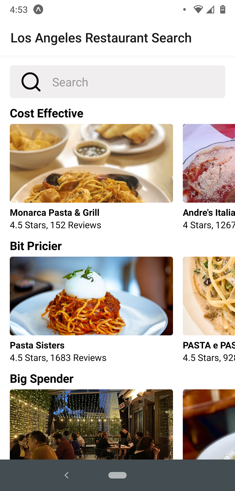
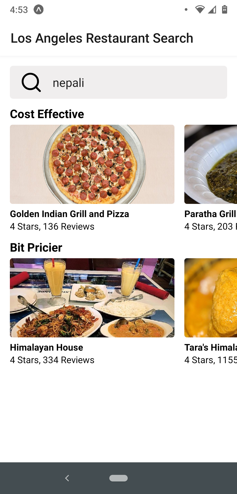

# Restaurant Search Application

This mobile application has been built using React Native. 

It searches for restaurants in Los Angeles and groups maximum of 50 restaurants in 3 categories: 
1. Cost Effective
2. Bit Pricier
3. Big Spender

